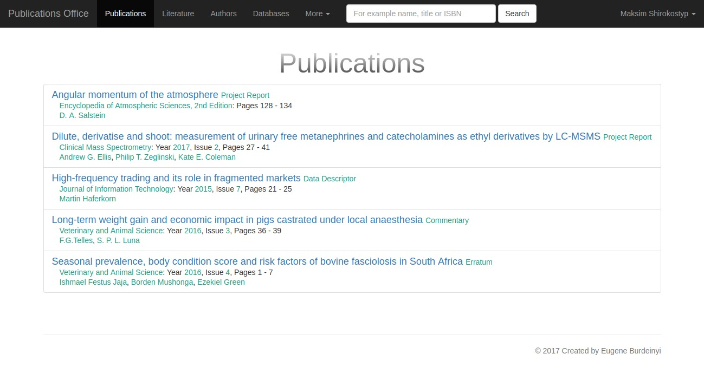
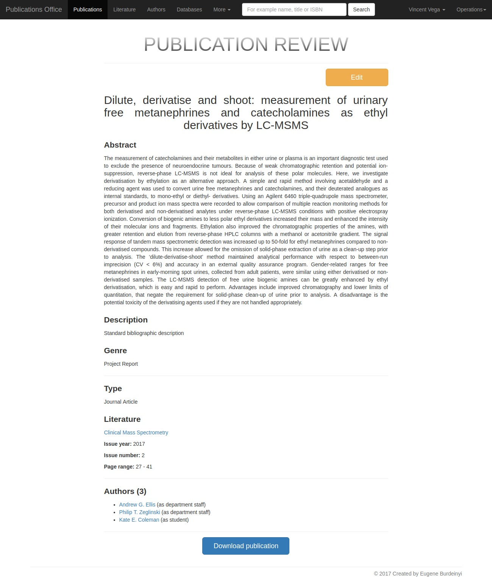

<h1 align="center">Publications Office</h1>

## About

Publications Office is the information system that allows you to easily manage a collection of publications written by teachers and students. Here you may search, download scientific works and certainly add something of your own.

## Features

- Responsive design and cross-browser compatibility
- Filtering, quick & advanced search
- Upload and download files of publications
- Soft deleting of entities: they still present if they are related to something else

## Structure

There are four entities that you can work with:
- publications
- literature (journals, books or conference proceedings)
- authors
- bibliographic databases

Each publication has authors and related literature which you can always explore more specifically. You may also find that selected literature, in turn, can refer to one or more bibliographic databases.

## Authentication & Authorization

Every user belongs to one of the following groups: guests, users, teachers, admins.
- Guests may only review and search information
- Users, in addition, are able to download publications
- Teachers are responsible for adding / updating / deleting entities
- Admins may completely remove or restore soft deleted entities

## Issues

See [notes.txt](notes.txt)

## Extra technologies

- jQuery
- AJAX
- Bootstrap
- Parsley

## [Screenshots](storage/screenshots)

